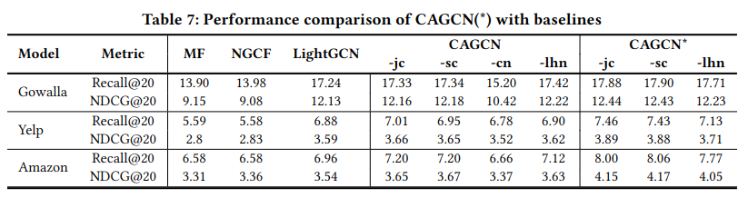

# Realistic setting (Training/Validation/Testing splitted by time)
By default setting used in most literature, the data splitting is performed by randomly sampling for each node, certain amount of its neighbors to be training/validation/testing data. However, such splitting may cause the issue of data leakage where we use future links (training data contains future links) to predict past links (testing data contains past links). To handle this issue, we recollect the gowalla/yelp/amazon_book datasets and split them strictly according to time, which mimics the real scenarios.


## Configuration
Similarly as the configuration used for experimental setting in the paper, the default version of python we use is 3.8.10. Please install all necessary python packages via:
```linux
- Pytorch 1.11.0 with Cuda 11.3
- Pytorch-geometric 2.0.4
- Torch-scatter 2.0.9
- Prettytable 3.2.0
```

## Data
We provide the preprocessing code in the notebook. Please follow instructions below for accessing the datasets and preprocessing them.
* **Gowalla**
  * Download loc-gowalla_totalCheckins.txt.gz [[here]](https://snap.stanford.edu/data/loc-gowalla.html) and following instructions [[here]](https://github.com/RUCAIBox/RecSysDatasets/blob/master/conversion_tools/usage/Gowalla.md) to process it and obtain gowalla.inter file. Put gowalla.inter file in ./data/gowalla/.
  * Run process_gowalla.ipynb and you should get train/val/test.txt
* **Yelp**
  * Download [[yelp_academic_dataset_review.json]](https://www.yelp.com/dataset/download) and put it in ./data/yelp/.
  * Run process_yelp.ipynb and you should get train/val/test.txt
* **Amazon_book**
  * Download [[Books_5.json]](https://nijianmo.github.io/amazon/index.html) here (select Books and we use 5-core setting) and put it in ./data/amazon_book/.
  * Run process_amazon.ipynb and you should get train/val/test.txt

In case the source dataset would be updated in the future, we also collect the current version used in this paper [[here]](https://www.dropbox.com/scl/fo/r8f0mad1u8cif062k1cv2/h?dl=0&rlkey=o48sfqa2quuz3ilk4eh7h7p1o). You can also download the datasets in this way.


After you preprocess the provided datasets, the correct directory structure should be set as follows:
```linux
├── data
│   ├── amazon
│   │   ├── co_ratio_edge_weight_co.pt
│   │   ├── co_ratio_edge_weight_jc.pt
│   │   ├── co_ratio_edge_weight_lhn.pt
│   │   ├── co_ratio_edge_weight_sc.pt
│   │   ├── test.txt
│   │   ├── val.txt
│   │   └── train.txt
│   ├── gowalla
│   │   ├── co_ratio_edge_weight_co.pt
│   │   ├── co_ratio_edge_weight_jc.pt
│   │   ├── co_ratio_edge_weight_lhn.pt
│   │   ├── co_ratio_edge_weight_sc.pt
│   │   ├── test.txt
│   │   ├── val.txt
│   │   └── train1.txt
│   └── yelp2018
│       ├── co_ratio_edge_weight_co.pt
│       ├── co_ratio_edge_weight_jc.pt
│       ├── co_ratio_edge_weight_lhn.pt
│       ├── co_ratio_edge_weight_sc.pt
│       ├── test.txt
│       ├── val.txt
│       └── train.txt
├── dataprocess.py
├── evaluation.py
├── main_fusion.py
├── main.py
├── model.py
├── parse.py
├── run_amazon.sh
├── run_gowalla.sh
├── run_yelp.sh
└── utils.py
```


## Result
Here we list the performance of our models CAGCN(*) with different topological variants. To reproduce the performance and running time in the following Table, please run the following commands:
```linux
bash run_gowalla.sh
bash run_yelp.sh
bash run_amazon.sh
```

