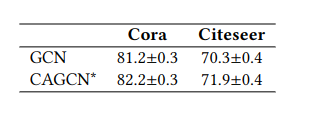

# Node classification
Here we experiment our CAGC on node classification by equipping it with GCN model.

**If you use this code, please consider citing:**
```linux
@inproceedings{CAGCN,
  author={Wang, Yu and Zhao, Yuying and Zhang, Yi and Derr, Tyler},
  title={Collaboration-Aware Graph Convolutional Networks for Recommendation Systems},
  booktitle={Proceedings of the ACM Web Conference 2023},
  year = {2023}
}
```

## Configuration
Similarly as the configuration used for experimental setting in the paper, the default version of python we use is 3.8.10. Please install all necessary python packages via:
```linux
- Pytorch 1.11.0 with Cuda 11.3
- Pytorch-geometric 2.0.4
- Torch-scatter 2.0.9
- Prettytable 3.2.0
```

## Result
Here we list the performance of our model CAGCN* on Cora and Citeseer. To reproduce the performance and running time in the following Table, please run the following commands:
```linux
python main_cora.py
python main_citeseer.py
```

